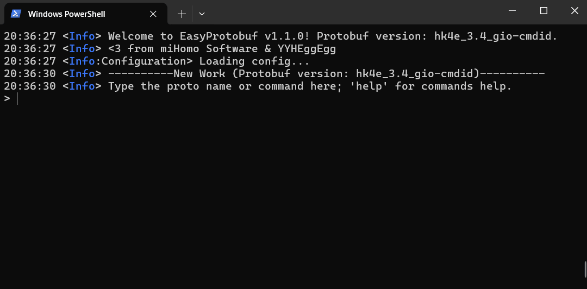
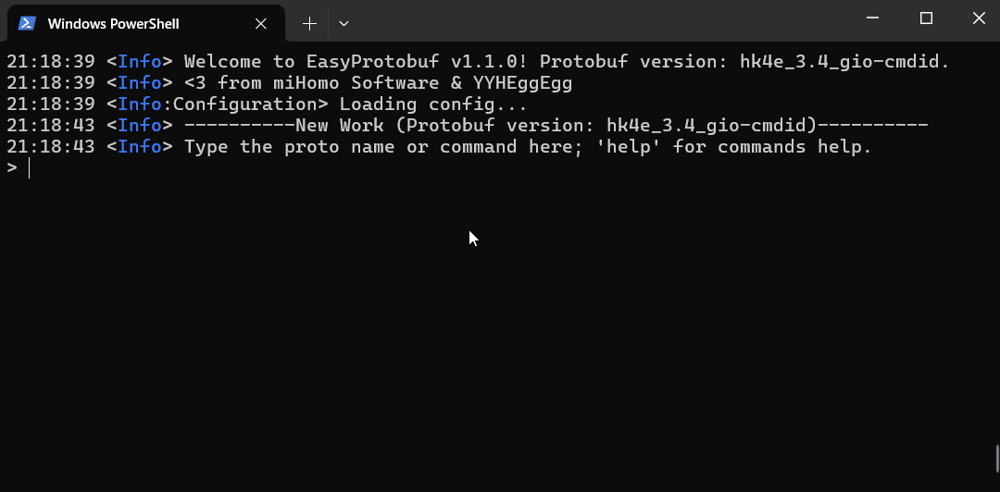
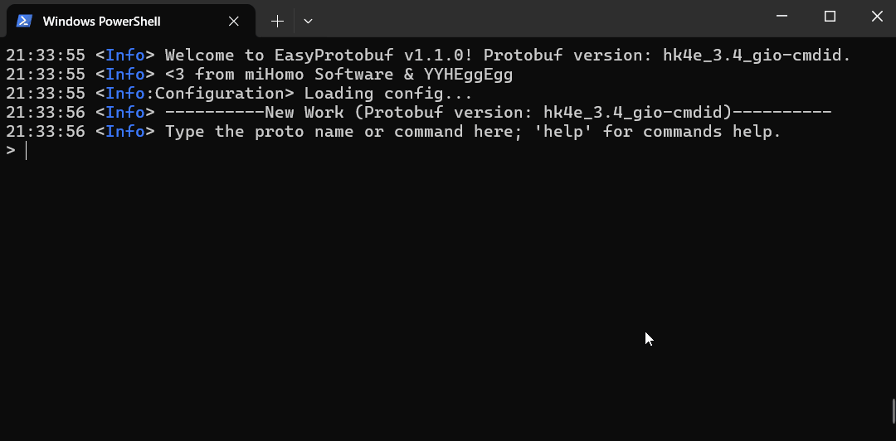
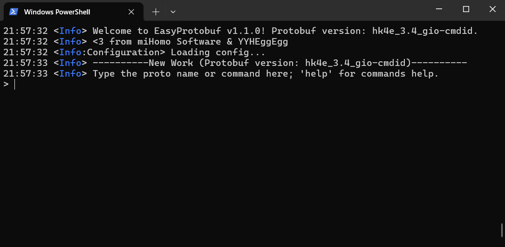

# EasyProtobuf

A easy tool for protobuf related operations.

_Made by miHomo Software_

<div>
  <a href="https://discord.gg/NcAjuCSFvZ">
    
  </a>
</div>

## What can it do?

- Protobuf
  - Convert Protobuf from JSON
  - Convert Base64 / HEX Protobuf to JSON
  - **Unknown Fields (not defined in your proto) detection**
- RSA
  - Basic RSA Encrypt / Decrypt / Sign / Verify
  - Query the format info of a RSA key
  - Generate a RSA key of specified format
  - **Convert RSA Keys through different formats (including Private -> Public)**
  - `query_cur_region` decryption & generation
- More Dedicated Applications
  - MT19937 XOR Key Generate
  - Ec2b decrypt `dispatchSeed` -> `dispatchKey`
- Simple Tasks
  - Convert bytes in Base64 & HEX
  - XOR Decrypt data

## Updates

#### 'Bash History'

When using the same command to launch EasyProtobuf, your command history will be preserved locally and recovered next time.

#### `rsa` command

- Added support of `.der` RSA keys for all `rsa`'s subcommands.
- Added `keygen` and `get-keytype` subcommand. For more information, please refer to the handbook.

#### Auto Completion

A simple Auto Completion is now supported! You can use `Tab` & `Shift+Tab` to switch in suggestions.

It can fill out:

- The command / subcommand names:
  

- Proto name:
  

- Command option names:
  

- Place your cursor in a pair of `""` to trigger file path completion. Please notice that you should **add a path separator** to show you're trying to enumerate a directory, not the peers of the specified file/directory.
  


## Requirements

- [.NET 6.0 Runtime](https://dotnet.microsoft.com/en-us/download)
- Network (for package restoration) (only during build process)

## Build

1. Give your protos a name as the `protobuf_version`, e.g. `hk4e_3.6_live`.
2. Create a directory here with name of `Protobuf-$(protobuf_version)`, e.g. `Protobuf-hk4e_3.6_live`.
3. Put `*.proto` files inside. e.g. `Protobuf-hk4e_3.6_live/...`. Files under `Protos` sub-directory is also accepted.
4. Start `./publish` with `protobuf_version`, e.g:

   ```sh
   ./publish hk4e_3.6_live
   ```

5. Check Output at `EasyProtobuf Build`

## Usage

- Build First
- Start with `./run`
- Search demanded command in `Handbook.md` or just type the proto name
- Profit

## Notes
- **Don't directly paste `query_cur_region` content here!** It's RSA encrypted.  
  You can use `dcurr` and `gencur` command to do related options.
- You can copy the built assets to anywhere, without neither original protos nor compiled code. But along with everything under the folder!
- If your protos contains `package` option, please enter the namespace into `config-<protobuf>.json`. e.g. If your proto has: 

  ```proto
  package miHomo.Protos;
  ```

  Then just use:

  ```json
  {
    // ...
    "EasyProtobufProgram": {
      "ProtoRootNamespace": "MiHomo.Protos"
    }
  }
  ```
